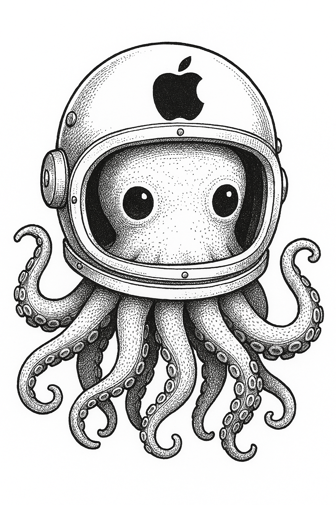

# Swift MLXKit

An unofficial Swift client library for interacting with [Apple's MLX framework](https://opensource.apple.com/projects/mlx).

## Requirements

- Swift 6+
- iOS 17+
- macOS 15+

## Installation

Add the following to your `Package.swift` file:

```swift
Package(
    dependencies: [
        .package(url: "https://github.com/nathanborror/swift-mlx-kit", branch: "main"),
    ],
    targets: [
        .target(
            name: "YourApp",
            dependencies: [
                .product(name: "MLXKit", package: "swift-mlx-kit"),
            ]
        ),
    ]
)
```

## Usage

### Chat Completion

```swift
import OpenAI

let client = Client()

let req = ChatRequest(
    messages: [.init(role: .user, content: "Hello, OpenAI!")],
    model: "mlx-community/Llama-3.2-1B-Instruct-4bit"
)

do {
    let response = try await client.chatCompletions(request)
    print(response)
} catch {
    print(error)
}
```
